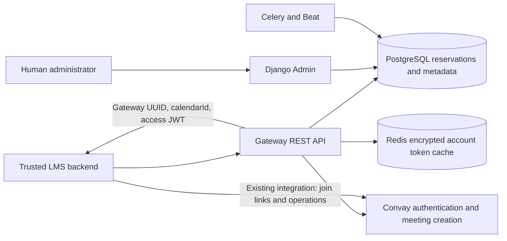
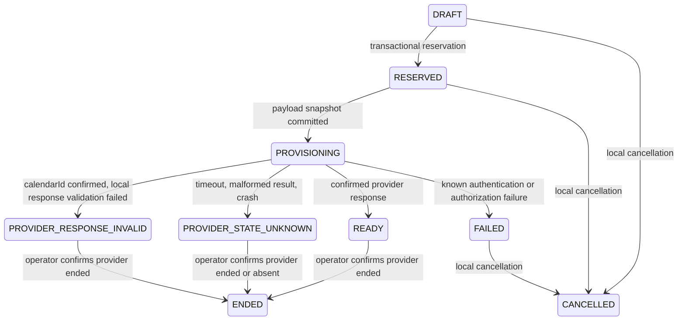

# Architecture

The LMS owns academic workflows, teachers, students, and direct post-creation Convay operations. Gateway stores reference metadata, owns collision-safe scheduling and provider credential privacy, and intentionally delegates Convay access JWTs to authorized LMS backends. Convay runs meetings. There is no general Convay API proxy.

A Room has a stable public ID and exactly one account identity. Username is private administrative metadata. Passwords use cryptography Fernet authenticated encryption, with a version prefix and environment-managed keys. Room account identity cannot change once meetings reference it. Password rotation increments credential version, invalidating cache reuse without changing which account owns historical meetings. Master key rotation supports previous keys through `CREDENTIAL_ENCRYPTION_PREVIOUS_KEYS`, a JSON version-to-key map held outside the database. Tokens in Redis and sensitive provider URLs are also encrypted. Refresh tokens are never returned or persisted by the cache.

Machine authentication uses 384-bit random client secrets, Django password hashing, constant-work checks for unknown clients, optional CIDR allowlists, and explicit scopes. The token exchange at `/api/v1/auth/token/` issues short-lived signed Gateway JWTs, always over TLS in production. LMS endpoints accept only Bearer JWTs. Signature, fixed HS256 algorithm, required claims, issuer, audience, expiry, client identity, revocation version, current active status, and socket IP allowlist are verified. Effective scopes intersect issued and current scopes; secret rotation changes the token version and revokes issued tokens. Signing/verification uses [PyJWT](https://pyjwt.readthedocs.io/en/stable/api.html). Raw secrets are rendered once following creation/rotation and are never stored in sessions or messages. The client UUID identifies the client; it is not itself an authentication secret. LMS endpoints have no session authentication. All meeting queries start from the authenticated client's ownership filter; foreign records yield 404. Superusers search across clients through Admin.

Booking intervals are finite `[start,end)` UTC-backed PostgreSQL `tstzrange` values. The configured before/after buffers expand the reservation interval; availability returns occupied buffered bounds. Transactions lock the meeting then the room, choose deterministically by room priority and public ID, check availability, and persist a reservation. The conditional GiST exclusion constraint is the final authority even for concurrent writes that bypass service checks. Adjacent unbuffered intervals do not conflict. `max_concurrent_bookings=1` is checked in PostgreSQL. A nullable provider active-meeting cap is separate and, when configured, counts unresolved/reserved/ready/live meetings under the room lock. This conservative count requires explicit operational completion, since time passing does not prove a Convay instant meeting ended.

State flow:

LIVE is reserved for future confirmed provider lifecycle integration. No arbitrary status editing is exposed. External calls happen after the reservation transaction commits; locks are not held for upstream HTTP. The only automatic creation retry is one attempt after a confirmed 401, cached-token invalidation, and successful re-authentication. Definite 4xx rejections fail cleanly; 5xx and uncertain transmission outcomes remain unknown. Ambiguous responses retain their booking. Beat flags stale PROVISIONING rows without making network calls. A successful late response can safely populate the original row because operators cannot release a PROVISIONING row; operational reconciliation of UNKNOWN must wait until the creating request has finished.

Scheduling concepts stay independent: `schedule_type=SCHEDULED`, `provider_meeting_type=INSTANT`, `provision_strategy=IMMEDIATE` is the normal setup. Payload hierarchy is system preset, integration preset, then room override, with nested configuration flags merged. Per-meeting arbitrary provider JSON is rejected. Meeting-specific override support is disabled. Validated presets may hold `instant` or `scheduled`, but scheduled requests are gated until the provider timestamp contract is established.

The public API requires no idempotency key. A database uniqueness constraint makes `(integration_client, external_class_id)` the registration identity. Row locks and meeting states make creation and cancellation naturally repeatable: READY returns existing provider data, PROVISIONING blocks a second provider call, and unknown outcomes require reconciliation. The PostgreSQL room exclusion constraint remains the final booking authority.

Audit events contain actor, object reference, request UUID, source IP, action, and allowlisted metadata. Provider error events include only internal error code, upstream status, and ambiguity flag. Event writers never accept arbitrary provider data. Admin cannot edit or delete audit records. A deployment needing tamper evidence should export audit records to append-only external storage and restrict database grants. Structured logs omit raw messages/tracebacks and record bounded, recursively sanitized provider error diagnostics. Django request logs recover the request ID from the request object after middleware context cleanup. Use request IDs to correlate API errors, provider diagnostics, and database audit events. See the provider contract notes for the classification table.
